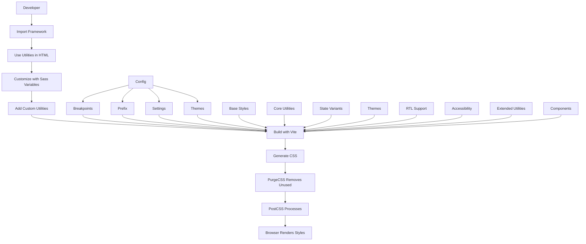

# Utility-First CSS Framework Design Proposal

## Overview

This document outlines a comprehensive folder and file structure for a utility-first CSS framework built with Sass. The design prioritizes modularity, maintainability, and developer experience while following industry best practices.

---

## Proposed Folder Structure

```
css-framework/
├── src/
│   ├── core/                      # Core utilities (always included)
│   │   ├── _index.scss            # Core entry point
│   │   ├── _spacing.scss          # Margin, padding, gap utilities
│   │   ├── _sizing.scss           # Width, height, max-width utilities
│   │   ├── _typography.scss       # Font size, weight, line-height utilities
│   │   ├── _colors.scss           # Color utilities (text, background, border)
│   │   ├── _flexbox.scss          # Flexbox utilities
│   │   ├── _grid.scss             # Grid utilities
│   │   ├── _positioning.scss      # Position, z-index utilities
│   │   ├── _display.scss          # Display utilities
│   │   ├── _borders.scss          # Border utilities
│   │   ├── _shadows.scss          # Box-shadow utilities
│   │   ├── _opacity.scss          # Opacity utilities
│   │   ├── _overflow.scss         # Overflow utilities
│   │   ├── _visibility.scss       # Visibility utilities
│   │   └── _transitions.scss      # Transition utilities
│   │
│   ├── states/                    # State variants (hover, focus, active, disabled)
│   │   ├── _index.scss            # States entry point
│   │   ├── _hover.scss            # Hover state utilities
│   │   ├── _focus.scss            # Focus state utilities
│   │   ├── _active.scss           # Active state utilities
│   │   └── _disabled.scss         # Disabled state utilities
│   │
│   ├── themes/                    # Theme support
│   │   ├── _index.scss            # Themes entry point
│   │   ├── _default.scss          # Default theme
│   │   ├── _dark.scss             # Dark mode theme
│   │   └── _custom.scss           # Custom theme support
│   │
│   ├── rtl/                       # Right-to-left language support
│   │   ├── _index.scss            # RTL entry point
│   │   ├── _spacing.scss          # RTL spacing utilities
│   │   └── _direction.scss        # Direction utilities
│   │
│   ├── accessibility/             # Accessibility utilities
│   │   ├── _index.scss            # Accessibility entry point
│   │   ├── _screen-reader.scss    # Screen reader utilities
│   │   └── _focus.scss            # Focus management utilities
│   │
│   ├── extended/                  # Extended utilities (optional)
│   │   ├── _index.scss            # Extended entry point
│   │   ├── _animations.scss       # Animation utilities
│   │   ├── _transforms.scss       # Transform utilities
│   │   ├── _filters.scss          # Filter utilities
│   │   └── _aspect-ratio.scss     # Aspect ratio utilities
│   │
│   ├── plugins/                   # Plugin system
│   │   ├── _index.scss            # Plugins entry point
│   │   ├── _forms.scss            # Form plugin
│   │   └── _carousel.scss         # Carousel plugin
│   │
│   ├── components/
│   │   ├── _index.scss            # Components entry point
│   │   ├── _buttons.scss          # Button styles
│   │   ├── _cards.scss            # Card component
│   │   ├── _forms.scss            # Form elements
│   │   ├── _alerts.scss           # Alert components
│   │   ├── _badges.scss           # Badge components
│   │   ├── _tables.scss           # Table styles
│   │   ├── _lists.scss            # List styles
│   │   └── _modals.scss           # Modal component
│   │
│   ├── base/
│   │   ├── _index.scss            # Base entry point
│   │   ├── _reset.scss            # CSS reset
│   │   ├── _normalize.scss       # Normalize.css
│   │   ├── _base.scss             # Base element styles
│   │   └── _variables.scss        # Design tokens (colors, spacing, etc.)
│   │
│   ├── config/
│   │   ├── _index.scss            # Config entry point
│   │   ├── _settings.scss         # Framework settings
│   │   ├── _breakpoints.scss      # Responsive breakpoints
│   │   ├── _prefix.scss           # Class name prefix configuration
│   │   └── _themes.scss           # Theme configuration
│   │
│   ├── mixins/
│   │   ├── _index.scss            # Mixins entry point
│   │   ├── _responsive.scss       # Responsive mixins
│   │   ├── _utilities.scss        # Utility generation mixins
│   │   ├── _components.scss       # Component mixins
│   │   ├── _states.scss           # State variant mixins
│   │   └── _themes.scss           # Theme mixins
│   │
│   ├── framework.scss             # Main framework file
│   └── framework.min.css          # Compiled minified CSS
│
├── dist/
│   ├── framework.css              # Compiled CSS
│   ├── framework.min.css          # Minified CSS
│   └── framework.css.map          # Source map
│
├── docs/
│   ├── index.html                 # Documentation
│   ├── utilities/                 # Utility documentation
│   ├── components/                # Component documentation
│   ├── themes/                    # Theme documentation
│   ├── accessibility/             # Accessibility documentation
│   └── assets/                    # Documentation assets
│
├── tests/
│   ├── unit/                      # Unit tests
│   │   ├── _variables.scss        # Variable tests
│   │   ├── _mixins.scss           # Mixin tests
│   │   └── _functions.scss        # Function tests
│   ├── integration/              # Integration tests
│   │   ├── _utilities.scss        # Utility integration tests
│   │   └── _components.scss       # Component integration tests
│   └── visual/                    # Visual regression tests
│
├── tools/
│   ├── build.js                   # Build script
│   ├── watch.js                   # Watch script
│   ├── generate.js                # Utility generator script
│   └── purgecss.js                # CSS purging script
│
├── package.json
├── vite.config.js                 # Build configuration
├── postcss.config.js              # PostCSS configuration
├── .sass-lintrc                   # Sass linting config
├── .editorconfig                  # Editor configuration
├── .browserslistrc                # Browser support configuration
├── purgecss.config.js             # PurgeCSS configuration
├── README.md
└── LICENSE
```

---

## File Structure Details

### 1. Core Utilities Directory (`src/core/`)

**Purpose:** Contains all essential utility classes following the utility-first paradigm.

#### Files:

- **`_index.scss`** - Central export file that imports all core utilities
- **`_spacing.scss`** - Margin, padding, and gap utilities
  - Classes: `m-1`, `p-2`, `mt-3`, `mr-4`, `mb-5`, `ml-6`, `mx-auto`, `gap-2`, etc.
- **`_sizing.scss`** - Width and height utilities
  - Classes: `w-25`, `w-50`, `w-75`, `w-100`, `h-25`, `h-50`, `h-75`, `h-100`, `max-w-screen`, etc.
- **`_typography.scss`** - Text-related utilities
  - Classes: `text-xs`, `text-sm`, `text-base`, `text-lg`, `text-xl`, `font-normal`, `font-bold`, `leading-tight`, `text-center`, etc.
- **`_colors.scss`** - Color utilities
  - Classes: `text-primary`, `bg-secondary`, `border-danger`, etc.
- **`_flexbox.scss`** - Flexbox utilities
  - Classes: `flex`, `flex-row`, `flex-col`, `justify-center`, `items-center`, `flex-wrap`, `flex-1`, `flex-grow`, etc.
- **`_grid.scss`** - Grid utilities
  - Classes: `grid`, `grid-cols-2`, `grid-cols-3`, `grid-cols-4`, `gap-4`, `col-span-2`, etc.
- **`_positioning.scss`** - Position utilities
  - Classes: `relative`, `absolute`, `fixed`, `sticky`, `top-0`, `right-0`, `z-10`, etc.
- **`_display.scss`** - Display utilities
  - Classes: `block`, `inline-block`, `inline`, `hidden`, `visible`, etc.
- **`_borders.scss`** - Border utilities
  - Classes: `border`, `border-2`, `border-t`, `border-b`, `rounded`, `rounded-lg`, `rounded-full`, etc.
- **`_shadows.scss`** - Shadow utilities
  - Classes: `shadow`, `shadow-md`, `shadow-lg`, `shadow-xl`, `shadow-none`, etc.
- **`_opacity.scss`** - Opacity utilities
  - Classes: `opacity-0`, `opacity-25`, `opacity-50`, `opacity-75`, `opacity-100`, etc.
- **`_overflow.scss`** - Overflow utilities
  - Classes: `overflow-hidden`, `overflow-auto`, `overflow-scroll`, `overflow-visible`, etc.
- **`_visibility.scss`** - Visibility utilities
  - Classes: `visible`, `invisible`, `hidden`, etc.
- **`_transitions.scss`** - Transition utilities
  - Classes: `transition`, `transition-all`, `duration-300`, `ease-in-out`, etc.

**Reasoning:** Separating utilities by category makes the framework:
- Easier to maintain and update
- More organized for developers
- Allows selective importing (only import what you need)
- Follows the single responsibility principle

### 2. States Directory (`src/states/`)

**Purpose:** Contains state variant utilities for interactive elements.

#### Files:

- **`_index.scss`** - States entry point
- **`_hover.scss`** - Hover state utilities
  - Classes: `hover:text-primary:hover`, `hover:bg-secondary:hover`, `hover:opacity-75:hover`, etc.
- **`_focus.scss`** - Focus state utilities
  - Classes: `focus:ring:focus`, `focus:outline-none:focus`, `focus:border-blue-500:focus`, etc.
- **`_active.scss`** - Active state utilities
  - Classes: `active:bg-primary:active`, `active:scale-95:active`, `active:translate-y-1:active`, etc.
- **`_disabled.scss`** - Disabled state utilities
  - Classes: `disabled:opacity-50:disabled`, `disabled:cursor-not-allowed:disabled`, `disabled:pointer-events-none:disabled`, etc.

**Reasoning:** State variants provide:
- Interactive feedback for users
- Accessibility support for keyboard navigation
- Consistent state management across components
- Enhanced user experience

### 3. Themes Directory (`src/themes/`)

**Purpose:** Contains theme definitions and dark mode support.

#### Files:

- **`_index.scss`** - Themes entry point
- **`_default.scss`** - Default theme with CSS custom properties
  - CSS Custom Properties: `--color-primary`, `--color-secondary`, `--spacing-1`, etc.
- **`_dark.scss`** - Dark mode theme
  - Classes: `dark:text-white`, `dark:bg-gray-900`, `dark:border-gray-700`, etc.
- **`_custom.scss`** - Custom theme support
  - Classes: `theme-primary`, `theme-secondary`, etc.

**Reasoning:** Theme support provides:
- Runtime theming capability
- Dark mode support
- Easy customization
- CSS custom properties for dynamic changes

**Example CSS Custom Properties:**
```scss
:root {
  --color-primary: #3b82f6;
  --color-secondary: #64748b;
  --color-success: #22c55e;
  --color-danger: #ef4444;
  --color-warning: #f59e0b;
  --color-info: #0ea5e9;
  --spacing-1: 0.25rem;
  --spacing-2: 0.5rem;
  --spacing-3: 0.75rem;
  --spacing-4: 1rem;
  --font-size-sm: 0.875rem;
  --font-size-base: 1rem;
  --font-size-lg: 1.125rem;
  --font-size-xl: 1.25rem;
  --border-radius-sm: 0.125rem;
  --border-radius-base: 0.25rem;
  --border-radius-lg: 0.5rem;
  --border-radius-full: 9999px;
}
```

### 4. RTL Directory (`src/rtl/`)

**Purpose:** Contains right-to-left language support utilities.

#### Files:

- **`_index.scss`** - RTL entry point
- **`_spacing.scss`** - RTL spacing utilities
  - Classes: `rtl:ml-4`, `rtl:mr-4`, `rtl:pl-4`, `rtl:pr-4`, etc.
- **`_direction.scss`** - Direction utilities
  - Classes: `rtl:flex-row-reverse`, `rtl:text-right`, `rtl:justify-end`, etc.

**Reasoning:** RTL support provides:
- Internationalization support
- Automatic margin/padding adjustment for RTL languages
- Consistent layout for Arabic, Hebrew, Persian languages

### 5. Accessibility Directory (`src/accessibility/`)

**Purpose:** Contains accessibility-focused utilities.

#### Files:

- **`_index.scss`** - Accessibility entry point
- **`_screen-reader.scss`** - Screen reader utilities
  - Classes: `sr-only`, `not-sr-only`, `sr-only-focusable`, etc.
- **`_focus.scss`** - Focus management utilities
  - Classes: `focus-visible`, `focus-within`, `focus-ring`, etc.

**Reasoning:** Accessibility utilities provide:
- Screen reader only content
- Focus management
- WCAG compliance support
- Enhanced accessibility for assistive technologies

**Example Accessibility Utilities:**
```scss
.sr-only {
  position: absolute;
  width: 1px;
  height: 1px;
  padding: 0;
  margin: -1px;
  overflow: hidden;
  clip: rect(0, 0, 0, 0);
  white-space: nowrap;
  border: 0;
}

.not-sr-only {
  position: static;
  width: auto;
  height: auto;
  padding: 0;
  margin: 0;
  overflow: visible;
  clip: auto;
  white-space: normal;
}

.focus-visible:focus {
  outline: 2px solid #3b82f6;
  outline-offset: 2px;
}
```

### 6. Extended Utilities Directory (`src/extended/`)

**Purpose:** Contains additional utilities for advanced use cases.

#### Files:

- **`_index.scss`** - Extended entry point
- **`_animations.scss`** - Animation utilities
  - Classes: `animate-spin`, `animate-pulse`, `animate-bounce`, `animate-fade-in`, etc.
- **`_transforms.scss`** - Transform utilities
  - Classes: `transform`, `scale-50`, `scale-100`, `rotate-45`, `translate-x-4`, `skew-x-12`, etc.
- **`_filters.scss`** - Filter utilities
  - Classes: `blur`, `blur-sm`, `blur-md`, `blur-lg`, `brightness-50`, `contrast-100`, etc.
- **`_aspect-ratio.scss`** - Aspect ratio utilities
  - Classes: `aspect-w-16`, `aspect-h-9`, `aspect-square`, `aspect-video`, etc.

**Reasoning:** Extended utilities provide:
- Advanced styling capabilities
- Animation support
- Transform effects
- Filter effects
- Aspect ratio control

### 7. Plugins Directory (`src/plugins/`)

**Purpose:** Contains plugin architecture for extensibility.

#### Files:

- **`_index.scss`** - Plugins entry point
- **`_forms.scss`** - Form plugin
  - Classes: `form-input`, `form-select`, `form-checkbox`, `form-radio`, `form-textarea`, etc.
- **`_carousel.scss`** - Carousel plugin
  - Classes: `carousel`, `carousel-item`, `carousel-control`, etc.

**Reasoning:** Plugin system provides:
- Extensibility for community contributions
- Optional features that can be included/excluded
- Modular architecture for specialized components
- Easy integration of third-party plugins

### 8. Components Directory (`src/components/`)

**Purpose:** Contains pre-built component classes that combine multiple utilities.

#### Files:

- **`_index.scss`** - Component exports
- **`_buttons.scss`** - Button component with variants
  - Classes: `btn`, `btn-primary`, `btn-secondary`, `btn-outline`, `btn-lg`, `btn-sm`, etc.
- **`_cards.scss`** - Card component
  - Classes: `card`, `card-header`, `card-body`, `card-footer`, etc.
- **`_forms.scss`** - Form element styles
  - Classes: `form-group`, `form-control`, `form-label`, `form-check`, etc.
- **`_alerts.scss`** - Alert components
  - Classes: `alert`, `alert-primary`, `alert-success`, `alert-danger`, etc.
- **`_badges.scss`** - Badge components
  - Classes: `badge`, `badge-primary`, `badge-pill`, etc.
- **`_tables.scss`** - Table styles
  - Classes: `table`, `table-striped`, `table-hover`, `table-bordered`, etc.
- **`_lists.scss`** - List styles
  - Classes: `list-group`, `list-item`, etc.
- **`_modals.scss`** - Modal component
  - Classes: `modal`, `modal-dialog`, `modal-content`, `modal-header`, etc.

**Reasoning:** Components provide:
- Reusable patterns that combine multiple utilities
- Consistent styling across the framework
- Balance between utility-first and component-based approaches
- Easy customization through utility overrides

### 9. Base Directory (`src/base/`)

**Purpose:** Contains foundational styles and design tokens.

#### Files:

- **`_index.scss`** - Base exports
- **`_reset.scss`** - CSS reset for cross-browser consistency
- **`_normalize.scss`** - Normalize.css integration
- **`_base.scss`** - Base element styles (html, body, headings, paragraphs, etc.)
- **`_variables.scss`** - Design tokens
  - Colors: primary, secondary, success, danger, warning, info, light, dark
  - Spacing scale: 0, 1, 2, 3, 4, 5, 6, 8, 10, 12
  - Typography scale: xs, sm, base, lg, xl, 2xl, 3xl, 4xl
  - Border radius: none, sm, base, md, lg, xl, full
  - Shadows: sm, base, md, lg, xl, 2xl

**Reasoning:** Base styles provide:
- Consistent foundation across all browsers
- Design tokens for easy theming
- Single source of truth for design decisions
- Easy customization through variable overrides

### 10. Config Directory (`src/config/`)

**Purpose:** Configuration files for framework behavior.

#### Files:

- **`_index.scss`** - Config exports
- **`_settings.scss`** - Framework settings
  - Enable/disable specific utilities
  - Set default values
  - Configure prefix
- **`_breakpoints.scss`** - Responsive breakpoints
  - sm: 640px
  - md: 768px
  - lg: 1024px
  - xl: 1280px
  - 2xl: 1536px
- **`_prefix.scss`** - Class name prefix configuration
  - Default: empty string
  - Can be customized (e.g., 'fw-', 'cfw-')
- **`_themes.scss`** - Theme configuration
  - Theme colors, spacing, typography, breakpoints

**Reasoning:** Configuration allows:
- Tree-shaking unused utilities
- Customizing framework behavior
- Setting project-specific defaults
- Maintaining consistency across projects

### 11. Mixins Directory (`src/mixins/`)

**Purpose:** Reusable Sass mixins for generating utilities.

#### Files:

- **`_index.scss`** - Mixin exports
- **`_responsive.scss`** - Responsive mixins
  - `respond-to($breakpoint)` - Generate responsive styles
  - `respond-above($breakpoint)` - Mobile-first approach
  - `respond-below($breakpoint)` - Desktop-first approach
- **`_utilities.scss`** - Utility generation mixins
  - `generate-spacing($prefix, $values)` - Generate spacing utilities
  - `generate-colors($prefix, $colors)` - Generate color utilities
  - `generate-typography($prefix, $sizes)` - Generate typography utilities
- **`_components.scss`** - Component mixins
  - `button-variant($color)` - Generate button variants
  - `alert-variant($color)` - Generate alert variants
- **`_states.scss`** - State variant mixins
  - `generate-states($property, $values)` - Generate state variants
- **`_themes.scss`** - Theme mixins
  - `generate-theme($name, $values)` - Generate theme variants

**Reasoning:** Mixins provide:
- DRY principle implementation
- Easy generation of consistent utilities
- Customization through parameters
- Maintainable code generation

**Example Utility Generation Mixin:**
```scss
@mixin generate-utilities($property, $values, $prefix: '') {
  @each $key, $value in $values {
    .#{$prefix}#{$key} {
      #{$property}: $value;
    }
  }
}

// Usage example
@include generate-utilities('margin', $spacing, 'm-');
@include generate-utilities('padding', $spacing, 'p-');
@include generate-utilities('color', $colors, 'text-');
@include generate-utilities('background-color', $colors, 'bg-');
```

### 12. Main Framework File (`src/framework.scss`)

**Purpose:** Central entry point that imports all framework parts.

```scss
// Framework entry point
@use 'config' as *;
@use 'base' as *;
@use 'core' as *;
@use 'states' as *;
@use 'themes' as *;
@use 'rtl' as *;
@use 'accessibility' as *;
@use 'extended' as *;
@use 'components' as *;
```

---

## Design Decisions and Reasoning

### 1. Sass Architecture

**Decision:** Use Sass (SCSS) as the preprocessor.

**Reasoning:**
- Sass provides powerful features like variables, mixins, functions, and nesting
- Industry standard for CSS frameworks (used by Bootstrap, Tailwind, etc.)
- Excellent tooling support and community
- Gradual learning curve from plain CSS
- Enables modular architecture

### 2. Utility-First Approach

**Decision:** Prioritize utility classes over component classes.

**Reasoning:**
- **Rapid development:** Build designs directly in HTML without switching between CSS and HTML
- **Consistency:** Reuse same utilities across different components
- **Maintenance:** Easier to understand and modify HTML than CSS files
- **Performance:** Only include utilities that are used (with tree-shaking)
- **Learning curve:** Fewer concepts to learn (just classes)

### 3. Modular Structure

**Decision:** Separate core, states, themes, RTL, accessibility, extended, plugins, components, base, config, and mixins into distinct directories.

**Reasoning:**
- **Organization:** Clear separation of concerns
- **Scalability:** Easy to add new utilities or components
- **Maintainability:** Changes in one area don't affect others
- **Import flexibility:** Users can import only what they need
- **Team collaboration:** Different team members can work on different parts
- **Performance:** Core utilities are always included, extended utilities are optional

### 4. Design Tokens

**Decision:** Use Sass variables AND CSS custom properties for design tokens (colors, spacing, typography).

**Reasoning:**
- **Consistency:** Single source of truth for design values
- **Customization:** Easy to override for theming
- **Maintainability:** Change in one place updates everywhere
- **Documentation:** Self-documenting design system
- **Interoperability:** Can be used in JavaScript with CSS custom properties
- **Runtime theming:** CSS custom properties enable dynamic theme changes

### 5. State Variants

**Decision:** Include hover, focus, active, and disabled state variants.

**Reasoning:**
- **Interactivity:** Provide visual feedback for user interactions
- **Accessibility:** Support keyboard navigation and focus states
- **Consistency:** Standardized state management across components
- **User experience:** Enhanced interactive feedback

### 6. Dark Mode Support

**Decision:** Include dark mode utilities using CSS custom properties and media queries.

**Reasoning:**
- **User preference:** Support for system-level dark mode preference
- **Accessibility:** Reduce eye strain in low-light environments
- **Modern design:** Dark mode is a standard feature in modern web applications
- **Runtime switching:** CSS custom properties enable dynamic theme switching

### 7. RTL Support

**Decision:** Include RTL (right-to-left) language support utilities.

**Reasoning:**
- **Internationalization:** Support for languages like Arabic, Hebrew, Persian
- **Automatic adjustment:** Automatic margin/padding adjustment for RTL languages
- **Consistent layout:** Maintain consistent layout across different languages
- **Global reach:** Enable use in international projects

### 8. Accessibility Utilities

**Decision:** Include screen reader and focus management utilities.

**Reasoning:**
- **WCAG compliance:** Support for Web Content Accessibility Guidelines
- **Screen reader support:** Provide content for screen readers only
- **Focus management:** Enhanced focus visibility and management
- **Inclusive design:** Support for users with disabilities

### 9. Extended Utilities

**Decision:** Include animation, transform, filter, and aspect ratio utilities.

**Reasoning:**
- **Advanced styling:** Support for advanced visual effects
- **Animation support:** Built-in animation utilities
- **Transform effects:** Support for CSS transforms
- **Filter effects:** Support for CSS filters
- **Aspect ratio control:** Consistent aspect ratio for images and videos

### 10. Plugin System

**Decision:** Include a plugin architecture for extensibility.

**Reasoning:**
- **Extensibility:** Allow community contributions and third-party plugins
- **Modularity:** Optional features that can be included/excluded
- **Specialized components:** Support for specialized UI components
- **Community growth:** Enable ecosystem growth

### 11. Responsive Design

**Decision:** Mobile-first responsive design with breakpoint prefixes.

**Reasoning:**
- **Performance:** Mobile styles are base, desktop enhancements are added
- **User experience:** Optimized for mobile devices first
- **Industry standard:** Follows best practices (used by Bootstrap, Tailwind)
- **Clarity:** Clear distinction between responsive and non-responsive styles
- **Flexibility:** Easy to create custom responsive patterns

### 12. Class Naming Convention

**Decision:** Use hyphenated lowercase names (e.g., `flex`, `items-center`, `text-lg`).

**Reasoning:**
- **Readability:** Easy to understand class purpose
- **Consistency:** Follows industry conventions (Tailwind, Bootstrap)
- **Keyboard friendly:** Easy to type and autocomplete
- **CSS friendly:** Valid class names
- **International:** No localization issues

### 13. Prefix Configuration

**Decision:** Allow configurable class name prefix.

**Reasoning:**
- **Namespace isolation:** Prevent conflicts with other CSS frameworks
- **Branding:** Custom prefix for framework branding
- **Legacy support:** Easy migration from other frameworks
- **Project customization:** Tailor to project requirements

### 14. Component Layer

**Decision:** Include pre-built components alongside utilities.

**Reasoning:**
- **Balance:** Combines utility-first with component-based approaches
- **Common patterns:** Provide ready-to-use components for common UI patterns
- **Learning example:** Components demonstrate utility combinations
- **Developer experience:** Faster development with pre-built components
- **Customization:** Components can be extended with utilities

### 15. Build System

**Decision:** Use Vite with Sass compilation, PostCSS processing, and PurgeCSS.

**Reasoning:**
- **Performance:** Fast compilation and hot reload
- **Optimization:** Minification, source maps, tree-shaking
- **Extensibility:** Easy to add post-processing (Autoprefixer, etc.)
- **Tooling:** Excellent IDE support and debugging
- **Future-proof:** Active development and community support
- **CSS purging:** Remove unused utilities for smaller bundle size

### 16. Documentation

**Decision:** Include comprehensive documentation structure.

**Reasoning:**
- **Developer experience:** Easy to learn and use
- **Adoption:** Lower barrier to entry for new users
- **Examples:** Code snippets and live demos
- **Searchability:** Easy to find utilities and components
- **Versioning:** Track changes and updates

### 17. Browser Support

**Decision:** Use `.browserslistrc` for browser support configuration.

**Reasoning:**
- **Flexibility:** Easy to configure supported browsers
- **Optimization:** Generate optimized CSS for target browsers
- **Compatibility:** Ensure cross-browser compatibility
- **Performance:** Optimize for target browser capabilities

### 18. Testing Strategy

**Decision:** Include unit, integration, and visual regression tests.

**Reasoning:**
- **Quality assurance:** Ensure framework quality
- **Regression prevention:** Prevent breaking changes
- **Integration testing:** Test utility combinations
- **Visual testing:** Ensure consistent visual appearance
- **Accessibility testing:** Test accessibility features

---

## Theme Configuration Example

```scss
// config/_themes.scss
$theme: (
  colors: (
    primary: #3b82f6,
    secondary: #64748b,
    success: #22c55e,
    danger: #ef4444,
    warning: #f59e0b,
    info: #0ea5e9,
    light: #f3f4f6,
    dark: #1f2937
  ),
  spacing: (
    0: 0,
    1: 0.25rem,
    2: 0.5rem,
    3: 0.75rem,
    4: 1rem,
    5: 1.25rem,
    6: 1.5rem,
    8: 2rem,
    10: 2.5rem,
    12: 3rem
  ),
  typography: (
    xs: 0.75rem,
    sm: 0.875rem,
    base: 1rem,
    lg: 1.125rem,
    xl: 1.25rem,
    2xl: 1.5rem,
    3xl: 1.875rem,
    4xl: 2.25rem
  ),
  breakpoints: (
    sm: 640px,
    md: 768px,
    lg: 1024px,
    xl: 1280px,
    2xl: 1536px
  ),
  border-radius: (
    none: 0,
    sm: 0.125rem,
    base: 0.25rem,
    md: 0.375rem,
    lg: 0.5rem,
    xl: 0.75rem,
    2xl: 1rem,
    full: 9999px
  ),
  shadows: (
    sm: 0 1px 2px 0 rgba(0, 0, 0, 0.05),
    base: 0 1px 3px 0 rgba(0, 0, 0, 0.1), 0 1px 2px 0 rgba(0, 0, 0, 0.06),
    md: 0 4px 6px -1px rgba(0, 0, 0, 0.1), 0 2px 4px -1px rgba(0, 0, 0, 0.06),
    lg: 0 10px 15px -3px rgba(0, 0, 0, 0.1), 0 4px 6px -2px rgba(0, 0, 0, 0.05),
    xl: 0 20px 25px -5px rgba(0, 0, 0, 0.1), 0 10px 10px -5px rgba(0, 0, 0, 0.04)
  )
);
```

---

## Workflow Diagram



---

## Build Configuration

### Vite Configuration (`vite.config.js`)

```javascript
import { defineConfig } from 'vite';
import sass from 'vite-plugin-sass';

export default defineConfig({
  plugins: [sass()],
  build: {
    cssCodeSplit: true,
    sourcemap: true,
    minify: 'esbuild'
  },
  css: {
    postcss: './postcss.config.js'
  }
});
```

### PostCSS Configuration (`postcss.config.js`)

```javascript
export default {
  plugins: {
    autoprefixer: {
      grid: 'autoplace',
      flexbox: 'no-2009'
    },
    cssnano: {
      preset: 'default'
    }
  }
};
```

### PurgeCSS Configuration (`purgecss.config.js`)

```javascript
export default {
  content: [
    './src/**/*.scss',
    './src/**/*.html',
    './src/**/*.js',
    './docs/**/*.html'
  ],
  safelist: [
    /-(hover|focus|active|disabled|visited|before|after)$/,
    /^(?!.*:not\().*$/,
    /^sr-only/,
    /^not-sr-only/
  ],
  extractors: [
    {
      extractor: (content) => {
        return content.match(/[^<>"'`\s]*[^<>"'`\s:]/g) || [];
      },
      extensions: ['html', 'js', 'scss', 'vue', 'react']
    }
  ]
};
```

### Browser Support Configuration (`.browserslistrc`)

```
# Default browsers
defaults
not IE 11
not op_mini all
```

---

## Next Steps

1. **Review and Approval:** Review this proposal and provide feedback
2. **Implementation:** Switch to Code mode to implement the framework
3. **Testing:** Create comprehensive test suite
4. **Documentation:** Build documentation website
5. **Release:** Package and publish the framework

---

## Questions for Clarification

1. **Target Audience:** Who is the primary user of this framework (enterprise, open source, personal projects)?
2. **Browser Support:** Which browsers should be supported (modern only, IE11, etc.)?
3. **Size Constraints:** Is there a maximum CSS file size requirement?
4. **Theme Requirements:** Should this support dark mode and multiple themes?
5. **RTL Support:** Should right-to-left languages be supported?
6. **Integration:** Will this integrate with existing projects or be standalone?
7. **Naming:** Should we use a specific prefix for the framework name?
8. **Animation Library:** Should we include a built-in animation library or use external libraries?
9. **JavaScript Integration:** Should we provide JavaScript utilities for interactive components?
10. **Package Format:** Should we support both ES modules and CommonJS?